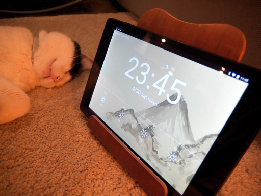

# floaty-color-clock
Produced for the javascript of learning.

## Setting
画面をクリックで設定項目を表示

設定した項目はブラウザを閉じても保持されます。

## bug report
うまく動作しない場合はIssueに登録してください。
追加して欲しい書体や機能もどうぞ。

## Features
* 時計
* 地域ごとの降水確率
* 書体の変更
* 文字色の変更
* 設定項目を自動で保持

## TODO
やらないかもしれない

* **Done!** <del>Chrome エクステンション化</del>
* 書体の追加
* Google カレンダーからのスケジュールの取得、表示
* ゴミの日 Notice
* 多言語対応
* アニメーションを維持したまま、背景色を変更